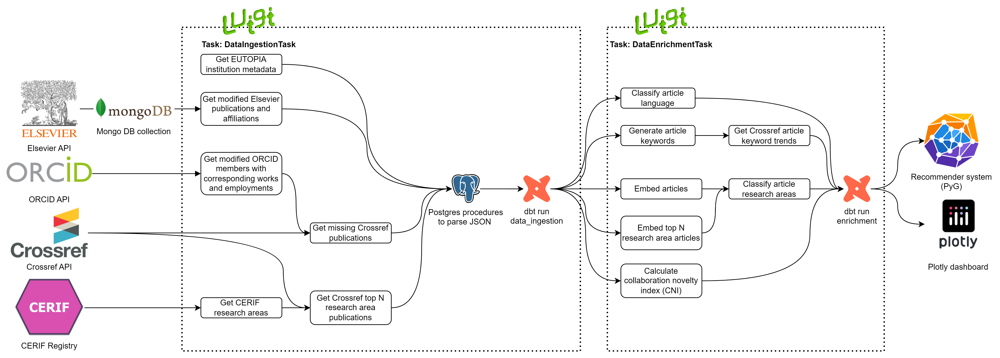

# Overview

**Author:** [@lukazontar](https://github.com/lukazontar)

To be able to develop an effective recommender system, we must ingest the data from reliable sources and transform raw
data into a clean data warehouse. We base all our results on the data from three different data sources: Elsevier,
Crossref and ORCID, all of which have publicly accessible REST APIs. Using open-source tools, we prepare a pipeline
that can efficiently update and refresh all our datasets on a recurrent basis to ensure our model and analytical
layer are always up-to-date.

The system consists of three main components:

1. Data sources used to gather the data.
2. Data infrastructure for storing and processing the data.
3. Data pipeline for ingesting and transforming the data, where we additionally separate the data ingestion and the data
   enrichment process.

A brief overview of the system is shown in the following diagram:

## Data infrastructure

Since we are working with large volumes of data, we need to build a scalable infrastructure capable of processing the
data within an acceptable timeframe. We developed an infrastructure using open-source tools. You can see how different
tools are used for different data tasks in the diagram:

Our data pipeline is orchestrated using the Luigi orchestrator, which is an open-source workflow orchestration service
developed by Spotify. We use MongoDB as the data lake to store raw data from Elsevier and Postgres as the data lake
and data warehouse for all other data and processed data. JSON files from data lake are first processed using stored
procedures in Postgres. Majority of data is then processed with dbt, which is an open-source framework that helps with
change management, data lineage and data quality within the transformation process. Articles are embedded using
HuggingFace transformer `allenai/specter2` and stored in Postgres data warehouse. We generate keywords using a Llama
model from the Ollama API that is running on FRI servers. Recommender system is built on PyTorch Geometric and served
using Fast API for inference. Dash is used for the collaboration analytics dashboard.

In some cases we also use Polars for data processing, which is built on Rust and is faster than Pandas.

## Data sources

As already mentioned, we gather our data from three different, external data sources. Starting
with [Elsevier](https://dev.elsevier.com/) as our main source of data, we use it to gather metadata about articles,
authors, their affiliations and most of our article content. Elsevier provides a REST API that allows us to access their
data. It also provides most accurate data due to their extensive data cleaning process.

Next, we enhance our dataset using [ORCID](https://info.orcid.org/what-is-orcid/services/public-api/), a unique
identifier registry for researchers. ORCID allows us to access metadata for authors and their affiliations. The ORCID
organization also provides a metadata dump of their database, which is updated yearly. Using ORCID to enhance our data
enables two important improvements. The first is that we are able to see the research landscape more holistically, e.g.
not all authors publish on Elsevier and hence ORCID serves as a source making our dataset more complete. Secondly, ORCID
as well as Elsevier provides us with clear distinction between authors using their unique identifiers, which is crucial
for our data model. If we started out with Crossref that does not provide unique identifiers for authors, we would have
to exploit author disambiguation techniques to distinguish between authors with the same name, which is a complex and
error-prone process.

Lastly, we use [Crossref](https://www.crossref.org/documentation/retrieve-metadata/rest-api/) to further improve the
quality of our data. Crossref allows us to access metadata for scholarly articles, specifically we are most interested
in article citations, references and textual content such as abstracts. While Crossref might be missing a lot of
publications, it is still a valuable source of data as it provides us with additional information about articles that we
ingest from Elsevier and ORCID.

Additionally, we use Crossref to fetch most relevant data for a given research area and to fetch trends for keywords.

Besides the aforementioned data sources, we also
use [CERIF registry](https://www.arrs.si/sl/gradivo/sifranti/sif-cerif-cercs.asp) to enable mapping of articles to a
bounded set of research areas that are used primarily for reporting purposes to get a wider segmentation of topics.
CERIF Registry is a registry available at aris website, where we see the Common European Research Information Format (
CERIF) standard. It is used as a registry of research areas to which we will map articles and authors.

To ingest the data from the CERIF registry, we downloaded the HTML from the website to `data/cerif.html`.

## Data pipeline

Our data pipeline first extracts the data from external sources, transforms it into a star schema data model and,
finally, offloads all the data to a data warehouse. We already covered the data sources. For the sake of simplicity, we
assume that historical data is ingested in the same manner as recurrent updates, although in reality it requires a
slightly different approach due to the volume of the data. We also assume that weekly data update is sufficient and
necessary to provide valuable insights.

We separate the data pipeline into two main parts: data ingestion and data enrichment.

Next, we ingest and update all the ORCID records
affiliated with the ingested articles. We use dbt to parse the raw data from JSON format to structured tables and use
those table to
embed article contents, disambiguate redundant authors, classify languages and research areas for each article and,
lastly, build the final model that includes intermediate metrics that will be further explained in the following
sections of preliminary analyses. Finally, we offload all the data to BigQuery, which serves as our data warehouse.

### Data ingestion task

Data ingestion is responsible for the weekly update of our data lake. We first ingest all articles affiliated with
EUTOPIA institutions indexed or modified in the past week and available in ORCID or Elsevier. For ORCID, we first fetch
all the modified members and then fetch all the articles and employments for these members. Next, we ingest all the
Crossref records affiliated with the ingested ORCID articles. We Postgres stored procedures to parse the raw data from
JSON format to structured tables and dbt for some initial data transformations.

### Data enrichment task

In the data enrichment task, we enhance our dataset with the following improvements:

- Embedding article contents using HuggingFace transformer `allenai/specter2`.
- Generate article keywords using the `llama3.1:8b` model from the Ollama API running on FRI servers.
- Fetch trends for the generated keywords using the Crossref API.
- Classify languages for each article using the `langdetect` library.
- Classify research areas for each article using cosine similarity and k-NN classification with the top research area
  publications fetched from
  Crossref (by relevance). Further explained in [Topic modeling](4_topic_modeling.md).
- Calculate the collaboration novelty index (CNI) for each article. Further explained in [Collaboration novelty
  index.md](3_collaboration_novelty_index).

