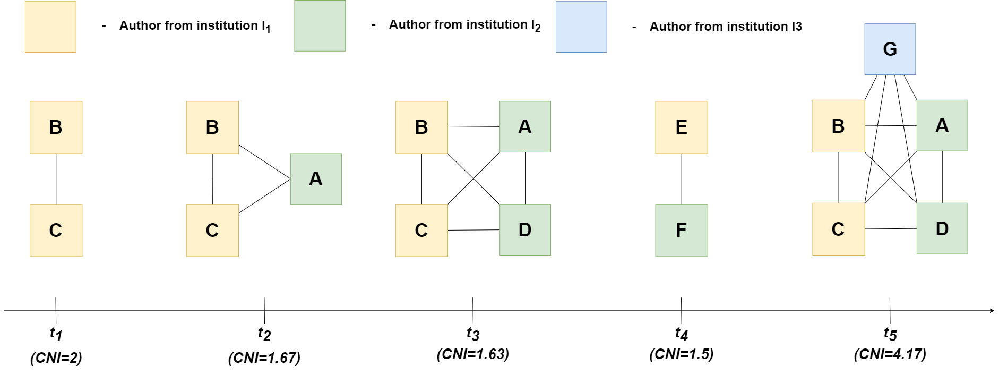

# Collaboration novelty index (CNI)

**Author:** [@lukazontar](https://github.com/lukazontar)

## Publication types

First, we define the following publication types:

- **Single author collaboration:** An article is considered a single author collaboration if it has only one author.
- **Internal collaboration:** An article is considered an internal collaboration if all authors are from the same
  institution.
- **External collaboration:** At a given point in time $t$, we define an **external collaboration** as a group of
  authors from at least two different institutions publishing an article together.
- **EUTOPIA collaboration:** we define a publication a **EUTOPIA collaboration**, when authors from two or more EUTOPIA
  institutions collaborate.

## New collaboration

**New collaboration:** we define a **new collaboration** as a unique set of authors that have not yet collaborated. That
is, a new collaboration is considered when an author collaborates with another author for the first time.

### Collaboration impact

Since not all collaborations are equally important, we define **collaboration novelty index** or **CNI** that captures the
importance of a new collaboration taking into account the following factors:

- it is more important if there is more new authors added,
- it is more important if a new author is from a new institution,
- it is more important if a new author is added to a small collaboration rather than a large one,
- if authors and institutions have already collaborated, then it is more important if there wasn't a lot of 
collaboration between them prior to the given publication.

Let's first define some **base terms**:

- $A_i$: Set of authors involved in the publication $p_i$ at time $t_1$.
- $I_i$: Set of institutions corresponding to article $p_i$.
- $A_{prev}$: Set of authors who have previously collaborated.
- $I_{prev}$: Set of institutions involved in previous collaborations.
- $C_{a,a}$: Number of prior collaborations between author pairs ($a_1$, $a_2$).
- $C_{i_1,i_2}$: Number of prior collaborations between institution pairs ($i_1$, $i_2$).
- $S_{old}$: Size of the old collaborations (number of old authors).

The **Collaboration Novelty Index (CNI)** is defined as follows:

- New authors impact: $N_{\text{A}} = \sum_{(a_1, a_2) \in A_i} \frac{1}{1 + C_{a_1, a_2}}$
- New institutions impact: $N_{\text{I}} = \sum_{(i_1, i_2) \in I_i} \frac{1}{1 + C_{i_1, i_2}}$
- Collaboration size adjustment: $S_A = \frac{1}{\sqrt{S_{\text{old}} + 1}}$
- Collaboration Novelty Index: $\text{CNI} = N_{\text{A}} \cdot (1 + N_{\text{I}}) \cdot S_A$

#### Example of CNI calculation
Say we have the following situation for authors $A$, $B$, $C$, $D$, $E$, $F$ and $G$:

- authors $A$, $D$ and $F$ are from institution $I_1$,
- authors $B$ and $C$ are from institution $I_2$ and
- author $G$ is from institution $I_3$.

- Assume the following scenario:

1. $t_1$: Then if authors $B$ and $C$ publish an article together, it is important because it is a collaboration of a new
pair of authors, but it is not a new collaboration on institution level.
  
    $N_A = \frac{1}{1 + 0} = 1$

    $N_I = 0$ (no combinations)

    $S_a = \frac{1}{0 + 1}$
  
    $NCI = 1 * 1 * 1 = 2$

2. $t_2$: However, if author 4A$ from a new institution joins authors $B$ and $C$ for the first time, then this is a new
collaboration on an institutional level and it as such it is more important even though it has less new authors.

    $N_A = \frac{1}{1 + 1} + \frac{1}{1 + 0} + \frac{1}{1 + 0} = 2.5$
    
    $N_I = \frac{1}{1 + 0} = 1$
    
    $S_a = 1 / 3 = 0.33$
    
    $NCI = 2.5 * 2 * 0.33 = 1.67$

3. $t_3$: If at a later point in time, author $D$ joins forces with authors $B$, $C$ and $A$ , it is less important because
it is a collaboration of authors that have already collaborated and only a new author from an already included
institution is added. A real life example of this would be a PhD student joining the group of his/her supervisor.
  
    $N_A = \frac{1}{1 + 2} + \frac{1}{1 + 1} + \frac{1}{1 + 1} + \frac{1}{1 + 0} + \frac{1}{1 + 0} + \frac{1}{1 + 0} = 0.33 + 2 * 0.5 + 3 * 1 = 4.33$

    $N_I = \frac{1}{1 + 1} = 0.5$
   
    $S_a = 1 / 4 = 0.25$
    
    $NCI = 1.63$

4. $t_4$: At a later point, author $E$ starts collaborating with author $F$, this is a new collaboration of great importance
because an entirely new collaboration is formed between two institutions, even though the institutions have already
collaborated.

    $N_A = \frac{1}{1 + 0} = 1$
    
    $N_I = \frac{1}{1 + 0} = 0.5$

    $S_a = \frac{1}{1 + 0} = 1$

    $NCI = 1.5$

5. $t_5$: Finally, if author $G$ joins the group of authors $B$, $C$, $A$ and $D$, it is more important because we create a new
institutional collaboration, even though the majority of authors have already collaborated.

    $N_A = \frac{1}{1 + 0} = \frac{1}{1 + 3} + \frac{2}{1 + 2} + \frac{3}{1 + 1} + \frac{4}{1 + 0} = 0.25 + 0.666 + 1.5 + 4 = 6.4167$

    $N_I = \frac{1}{1 + 3} + 2 * \frac{1}{1 + 0} = 2.25$

    $S_a = \frac{1}{1 + 4} = 0.2$

    $NCI = 4.17$

This case returns the following CNI values:

| Collaboration | CNI  |
|---------------|:----:|
| $t_1$         | 1.00 |
| $t_2$         | 1.67 |
| $t_3$         | 1.63 |
| $t_4$         | 1.33 |
| $t_5$         | 4.17 |
