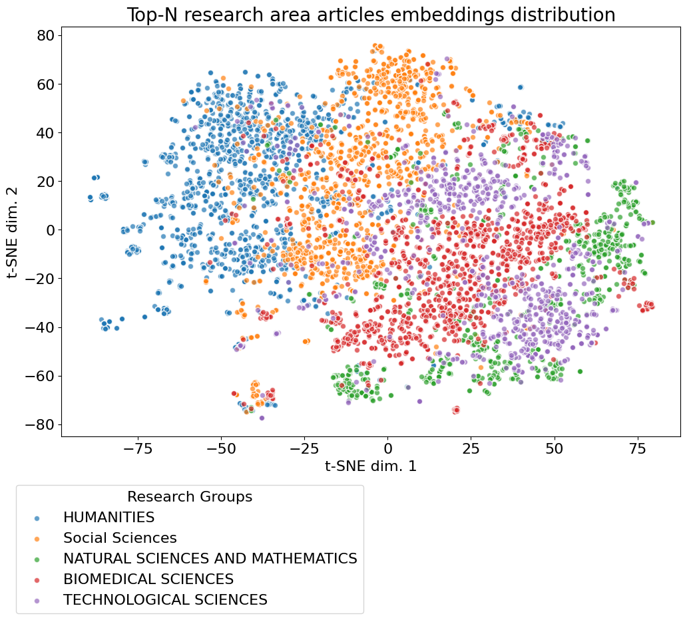

# Topic modeling

This document provides an overview of the processes involved in embedding research areas and articles, and deriving the
most probable research areas for each article based on their embeddings. The scripts interact with the CERIF (Common
European Research Information Format) registry, which is a standard for managing and exchanging research information in
a structured manner. It provides a structured format for representing various research entities such as projects,
publications, patents, and organizational units. CERIF ensures interoperability and enhances the accessibility of
research information across different systems and institutions.

We use Crossref API to fetch the top N articles by relevance querying research area from the CERIF registry. The top N
articles are then embedded using a transformer model from HuggingFace: `allenai/specter2`. This model was chosen because
it is specifically trained on scientific texts. The embeddings of top N articles are then combined and stored in
Postgres. In figure below, you can see the embedding space of the articles of the research areas:

We classify the research areas using cosine similarity between the embeddings of articles and top N articles of research
areas. Lastly, we apply k-NN classification to derive the most probable research areas for each article.
